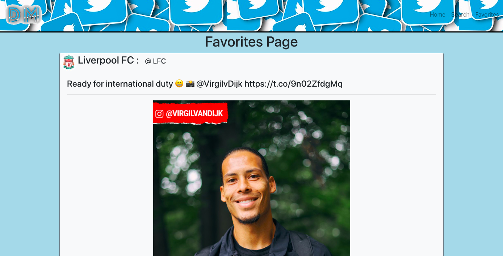

# twitter-app

My own personal spin on the popular Twitter app that allows users to search for Twitter user accounts and view the most recent tweets.  

# Try out my Twitter App!
Click [here](https://twitter-app-david-m.herokuapp.com/)

#Screen shot

# Summary 
This app was by far the most challenging and rewarding project to date. I learned how to implement OAuth2 Authentication by passing in a Bearer Token, creating multiple pages through Routes, and displaying multiple types of media retrieved from an API call. The most challenging of these was the media portion, but the most rewarding in terms of knowledge and confidence gained. This app as a whole has helped me to grow leaps and bounds in my programming abilities and has sparked a drive to continue learning more. I hope you enjoy what I've put together here!

## Author
David Malchow - Software Developer [LinkedIn](https://www.linkedin.com/in/david-malchow-809b106b/)
